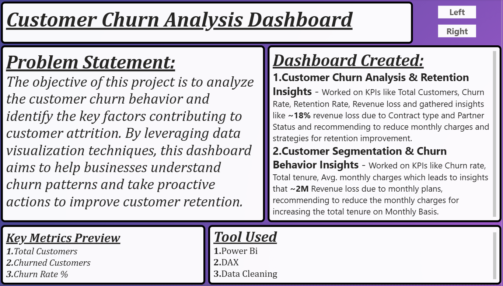
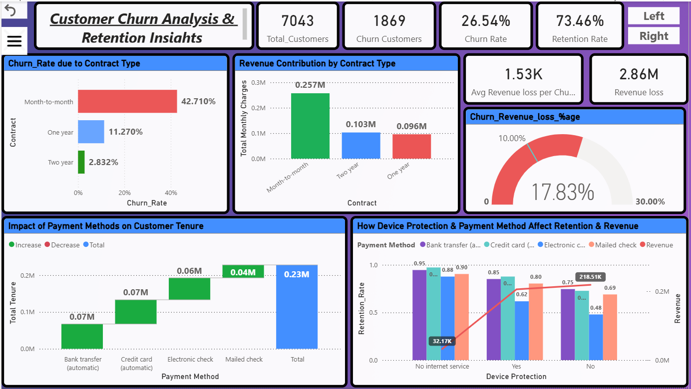
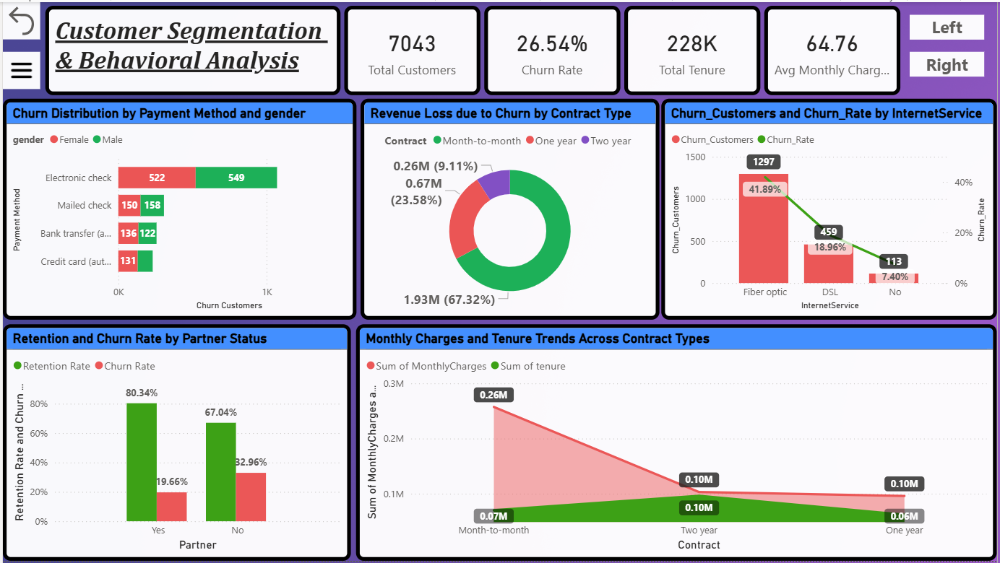
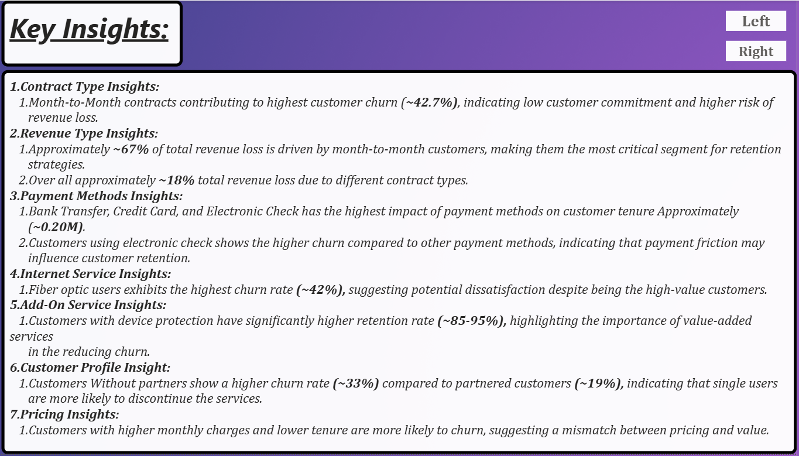
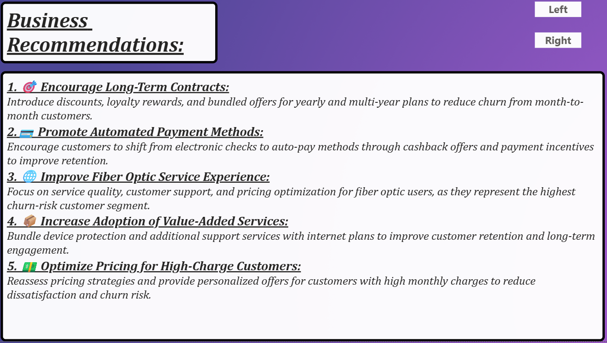

## 📊 Customer Churn Analysis Dashboard - Power BI

## 📌 Project Overview

This project presents a comprehensive Customer Churn Analysis Dashboard developed in Power BI using interactive visualizations, KPIs, DAX measures, filters, and business intelligence techniques.

The dashboard analyzes customer retention and churn behavior by tracking:
- Customer Retention Rate.
- Customer Churn Rate.
- Customer Demographic.
- Contract & Subscription Analysis.
- Payment Method Analysis.
- Service Usage Pattern.
- Customer Segmentation.
- Revenue Impact of Churn.

The objective of this project is to identify the key factors contributing to customer churn and provide actionable insights that help businesses improve customer retention and long-term profitability.

---

## 💼 Business Problem

Customer churn directly impacts revenue growth and customer lifetime value. Organizations often struggle to identify the reasons behind customer attrition and the customer segments most likely to leave.

Without proper analysis, businesses face challenges such as:
- Increasing customer acquisition costs.
- Reduce customer lifetime value.
- Revenue loss from customer attrition.
- Ineffective retention campaigns.
- Poor customer engagement strategies.

This dashboard helps stakeholders understand churn drivers, monitor retention performance, and develop effective customer retention strategies.

---

## 📑 Table of Contents

- [Project Overview](#-project-overview)
- [Business Problem](#-business-problem)
- [Objectives](#-objectives)
- [Dashboard Features](#-dashboard-features)
- [Key KPIs](#-key-kpis)
- [Dashboard Images](#-dashboard-images)
- [Key Insights](#-key-insights)
- [Business Recommendations](#-business-recommendations)
- [Dataset Information](#-dataset-information)
- [Dataset Source](#-dataset-source)
- [Tools & Technologies](#️-tools--technologies)
- [Data Cleaning & Preparation](#-data-cleaning--preparation)
- [Project Workflow](#-project-workflow)
- [Project Impact](#-project-impact)
- [Project Structure](#-project-structure)
- [How to Use](#️-how-to-use)
- [Author & Contact](#author--contact)

---

## 🎯 Objectives

- Analyze customer churn and retention rates.
- Identify high-risk customer segments.
- Understand churn behavior across demographics.
- Evaluate contract and subscription patterns.
- Analyze customer tenure and service usage.
- Generate actionable retention strategies.
- Support data-driven decision-making.

---

## 📌 Dashboard Features

✅ Interactive Power BI Dashboard
✅ KPI Cards & Dynamic Metrics
✅ Customer Segmentation Analysis
✅ Churn & Retention Analysis
✅ Contract Type Evaluation
✅ Payment Method Analysis
✅ Service Subscription Insights
✅ Interactive Filters & Slicers
✅ Business Intelligence Reporting

---

## 📊 Key KPIs

- Total Customers.
- Churned Customers.
- Retained Customers.
- Churn Rate (%).
- Retention Rate (%).
- Average Customer Tenure.
- Monthly revenue.
- Contract Distribution.
- Service Adoption Metrics.

---

## 📸 Dashboard Images

### 🔹 Project Overview & Business Objectives


This page introduces the customer churn problem, project objectives, KPIs, and dashboard navigation while providing business context for the analysis.


### 🔹 Customer Churn & Retention Analysis Dashboard


This dashboard provides a comprehensive overview of customer churn trends, retention performance, customer demographics, revenue impact, and service subscription patterns.

### 🔹 Customer Segmentation & Churn Behavior Dashboard


This dashboard explores customer behavior across demographic groups, contract types, payment methods, tenure segments, and service usage to identify churn-prone customers.

### 🔹 Key Insights


Highlights major analytical findings, customer behavior trends, churn drivers, and retention opportunities identified during the analysis.

### 🔹 Business Recommendations


Presents actionable recommendations focused on improving customer retention, reducing churn risk, increasing engagement, and maximizing customer lifetime value.

---

## 📈 Key Insights

### 📌 Contract Type Influences Churn

Customers with month-to-month contracts exhibit significantly higher churn rates compared to long-term contract customers.

### 📌 Customer Tenure Impacts Retention

Long-term customers demonstrate stronger loyalty and significantly lower churn probability.

### 📌 Payment Preferences Affect Churn

Certain payment methods are associated with higher churn rates, indicating opportunities for process improvements.

### 📌 Service Adoption Improves Retention

Customers subscribed to multiple services show higher engagement and improved retention rates.

### 📌 High-Risk Customer Segments Identified

Specific demographic and behavioral segments contribute disproportionately to overall customer churn.

### 📌 Revenue Loss Concentration

A significant portion of revenue loss originates from recurring churn among high-value customer groups.

---

## 🚀 Business Recommendations

- Promote long-term contract plans through targeted incentives.
- Implement proactive customer retention programs.
- Develop personalized engagement campaigns for high-risk customers.
- Improve onboarding experiences for new customers.
- Strengthen customer support and issue resolution processes.
- Offer loyalty rewards and retention discounts.
- Monitor churn indicators through predictive analytics.
- Increase adoption of value-added services and bundled packages.

---

## 📂 Dataset Information

The dataset contains customer-related information including:

- Customer ID
- Gender
- Age Group
- Contract Type
- Payment Method
- Monthly Charges
- Total Charges
- Customer Tenure
- Service Subscriptions
- Churn Status

---

## 📂 Dataset Source

Dataset obtained from Kaggle and further cleaned, transformed, and modeled for churn analysis purposes.

Original Dataset:
[DataSet Download](Data/Telco_Customer_Churn_Dataset.csv)

---

## 🛠️ Tools & Technologies

- Power BI
- Power Query
- DAX
- Data Modeling
- Data Visualization
- Business Intelligence Analytics
- Customer Segmentation Techniques

---

## 🧹 Data Cleaning & Preparation

The following data preparation steps were performed:

- Removed duplicate records
- Handled missing values
- Standardized categorical variables
- Cleaned customer demographic data
- Created calculated measures using DAX
- Designed dashboard-ready data model
- Optimized reporting performance

---

## 🔄 Project Workflow

1. Data Collection
2. Data Cleaning
3. Data Transformation
4. Data Modeling
5. DAX Measure Creation
6. Dashboard Development
7. Customer Churn Analysis
8. Insight Generation
9. Business Recommendation Development


---

## 💡 Business Value

- Imporved customer retention strategy
- Reduced customer attrition risk
- Enhanced customer lifetime value
- Enabled data-driven decision-making
- Imporved customer engagement initiatives
- Increase operational efficiency through analytics
- Supported proactive churn management

---

## 📂 Project Structure

```bash
CUSTOMER_CHURN_ANALYTICS_DASHBOARD-POWER_BI
│
├── Readme.md
├── .gitignore
├── Customer_Churn_Analysis_Report.pdf
│
├── Dashboard
│   └── Customer_Churn_Analysis.pbix
│
├── Data
│   └── Telco_Customer_Churn_Dataset.csv
│
└── Images
    ├── 01.Customer_Churn_Analysis_Overview.png
    ├── 02.Customer_Churn_Analysis_and_Retention_Insights.png
    ├── 03.Customer_Segmentation_and_Behavioral_Analysis.png
    ├── 04.Key_Insights.png
    └── 05.Business_Recommendations.png
```

---

## ▶️ How to Use

1. Download the Power BI project file
2. Open the .pbix file using Power BI Desktop
3. Refresh the dataset if required
4. Use filters and slicers to explore customer segments
5. Analyze churn trends and business insights
6. Review recommendations for retention improvement

---

## Author & Contact

Dhammadeep Gajbhiye
Data Analyst | Power BI | SQL | Python | Excel

- Email: dhammdeepgajbhiye32@gmail.com
- LinkedIn: https://linkedin.com/in/dhammdeep-gajbhiye-57b38b16a/
- GitHub: https://github.com/dhammdeepgajbhiye32

⭐ If you found this project useful, consider giving it a ⭐ on GitHub and sharing your feedback.
